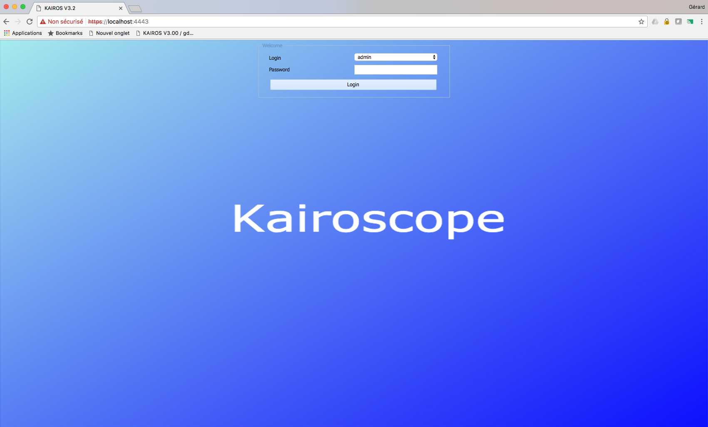

## Introduction 

`KAIROS` is a complete application bundled into a `DOCKER` container. Its main goal is to help an engineer to identify performance problems on large systems.

At the beginning `KAIROS` was focusing on the `ORACLE` Database and underlying systems, but this now an open system being able to be extended by users on other layers (System, MYSQL, Postgres, Applications servers, ...)

One main characteristic of `KAIROS` is the capability to work in a disconnected way: no need to have an heavy infrastructure with agents.

Regarding `ORACLE` Database, everything is ready for users: a script is available to collect metrics on production systems (this script is calling AWR or Statspacks reports with the capability to get ASH data). The result of the collect is an archive (zip or compressed tar file) that has to be transferred to the `KAIROS` system.

After everything is automatic and the `KAIROS` end user can navigate into menus and see various charts illustrating the system performance.

As said above, `KAIROS` can be extended to other domains by experts in these domains. They will have to define the way to collect data, menus, charts, queries, ...

## Screenshots

###### An overview of `KAIROS`desktop


###### Drop down menus


###### A look to the main "wait events" of an Oracle database during a particular day (precision: one minute)


## Documentation

The documentation is available in the tool and [here](https://openkairos.freshdesk.com/support/solutions/).

## Installation

`KAIROS` can be installed on [any system suporting `DOCKER`](https://docs.docker.com/engine/installation/). This includes a variety of Linux systems, `Mac OS X` and recent `WINDOWS` systems.

There are several steps in the installation:
-	`DOCKER` installation
-	`KAIROS` software download
-	`KAIROS` container creation and configuration

### Docker installation

This step is widely described in the [`DOCKER` official documentation](https://docs.docker.com/engine/installation/).

### Kairos software download

When the `DOCKER` environement is started, we can start to manipulate "images" and other "containers" objects.

`KAIROS` is delivered as a `DOCKER` image. From this image, we are going to create a container who will be started. Once the container is started, the `KAIROS` application is available.

To download `KAIROS`, the following command must be issued:

```
docker pull gdsc/kairos
```

During the first execution, everything will be downloaded and several hundred of megabytes will be downloaded. In fact, this is not a single file but a set of chunks with different sizes.

When a new version of the software is delivered, most of the chunks will remain unchanged and `DOCKER` will download only the modified chunks.

### Kairos container creation and configuration

The `KAIROS` container is created like this:

```
docker create 
        -it 
        --name kairos 
        -h kairos
        -P --privileged -v /sys/fs/cgroup:/sys/fs/cgroup 
        -p 2443:443
        -v /Users/gdsc/Documents/kairos_store/data:/home/agensgraph/data 
        -v /Users/gdsc/Documents/kairos_store/files:/files 
        -v /Users/gdsc/Documents/kairos_autoupload:/autoupload 
        gdsc/kairos
```

The `KAIROS` container must remain a black box with no user data inside. For this, when the container is created, we have to specify (-v option) which directories are mounted within the container to access data. 3 directories are mounted externally:
-	/home/agensgraph/data
-	/files
-	/autoupload

The `KAIROS` container is also listening on 1 port (443). This port must be routed (-p option) on  a port belonging to the physical machine hosting docker. 

Once created, this container can be started with this command:

```
docker start kairos
```
 
An interactive session (for `KAIROS` administrator) can even be started like this (not necessary):

```
docker exec -it kairos bash
```
 
 We can now check that the application is available by using a browser on the host system with the following URL:

```
https://physical_machine:2443
```



Now the container creation is over.

For the future, it will be enough to start the container with:

```
docker start kairos
```

and to stop the container with:

```
docker stop kairos
```
