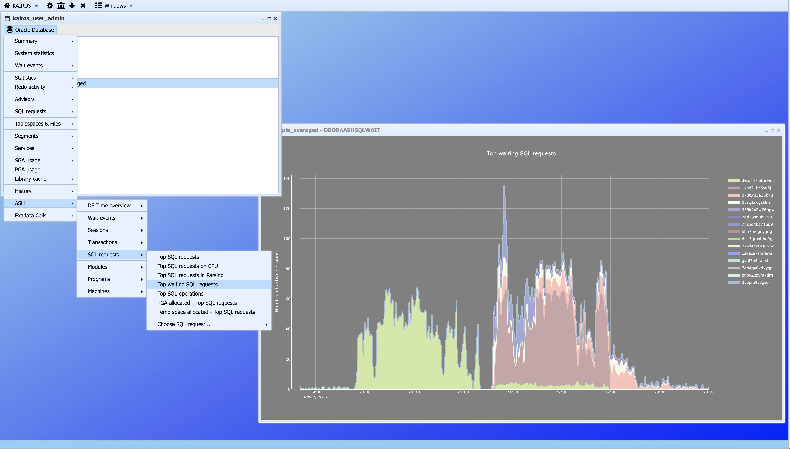

## Introduction 

`KAIROS` is a complete application bundled into a `DOCKER` container. Its main goal is to help an engineer to identify performance problems on large systems.

At the beginning `KAIROS` was focusing on the `ORACLE` Database and underlying systems, but this now an open system being able to be extended by users on other layers (System, MYSQL, Postgres, Applications servers, ...)

One main characteristic of `KAIROS` is the capability to work in a disconnected way: no need to have an heavy infrastructure with agents.

Regarding `ORACLE` Database, everything is ready for users: a script is available to collect metrics on production systems (this script is calling AWR or Statspacks reports with the capability to get ASH data). The result of the collect is an archive (zip or compressed tar file) that has to be transferred to the `KAIROS` system.

After everything is automatic and the `KAIROS` end user can navigate into menus and see various charts illustrating the system performance.

As said above, `KAIROS` can be extended to other domains by experts in these domains. They will have to define the way to collect data, menus, charts, queries, ...

## Screenshots

###### An overview of `KAIROS`desktop


###### Drop down menus



###### A look to the main "wait events" of an Oracle database during a particular day (precision: one minute)


###### A view to NMON statistics


## Documentation

The documentation is available in the tool and [here](https://www.github.com/gduvalsc/kairos/blob/master/kairos.pdf).

## Installation

`KAIROS` can be installed on [any system suporting `DOCKER`](https://docs.docker.com/engine/installation/). This includes a variety of Linux systems, `Mac OS X` and recent `WINDOWS` systems.

There are several steps in the installation:
-	`DOCKER` installation
-	`DOCKER` configuration
-	`KAIROS` software download
-	`KAIROS` container creation
- 	`KAIROS` container configuration

### Docker installation

This step is widely described in the [`DOCKER` official documentation](https://docs.docker.com/engine/installation/). However, un example of installation on `WINDOWS 10` is given hereafter. 

#### Docker installation on `WINDOWS 10`

Under `WINDOWS` (as under `Mac OS X`), `DOCKER` can't be used **natively** by the Operating System. A virtual machine with a Linux supporting containers is needed. The `DOCKER` driving is made from the host system by a set of commands, but containers are run from a virtual machine.

When you install `DOCKER`, if `VIRTUALBOX` is not installed under the host system, then `DOCKER` will install this free software coming from `ORACLE`.

`DOCKER` must be installed from this adress: [https://www.docker.com/products/docker-toolbox](https://www.docker.com/products/docker-toolbox)


Under `Mac OS X`, the method is the same, selecting the apple button instead.

In the actual version of `DOCKER`, there are roughly 200 Megabytes to download, so a few minutes of patience ...


After a while, once the file is downloaded, the installation can start with the following exchanges:


Until this step, `DOCKER` and `VIRTUALBOX` installations are over.

2 shortcuts have been inserted on the desktop for the next steps ...


If we call "Docker Quicstart Terminal", `VIRTUALBOX` is launched automatically and a virtual machine named "default" is created. I don't like this way of doing things. In my mind, the name of the virtual machine running `DOCKER` should be "docker".

So, to avoid the creation of this "default" machine, I suggest you the following steps to create a "docker" machine:

You need to call the "cmd" command of `WINDOWS` and in the created terminal, you run "docker-machine":

```
docker-machine
```

The following screen is then displayed:


Without any parameter, the "docker-machine" command lists all available options.

Especially, there is a "ls" option to list all `DOCKER` machines created on the system.

```
docker-machine ls
```

In our case, just after installation, the list is obviously empty:


We are now ready to create a new `DOCKER` machine and assign the name "docker":


```
docker-machine create --driver virtualbox docker
docker-machine ls
```


Now the "docker" virtual machine is created. With the "ls" option of "docker-machine" command, we can see the state of the virtual machine (Stopped or Running) as weel as the IP adress used.

To stop the "docker" virtual machine:

```
docker-machine stop docker
```


To start again the "docker" machine:

```
docker-machine start docker
```


As stated, the "docker" machine can have a different IP adress when it's restarted. This must be checked with "docker-machine ls". When the IP adress is modified, certificates attached to this system must be regenerated:

```
docker-machine regenerate-certs docker
```


From Virtualbox, we can see the following screen:


Until this step, `DOCKER` installation and configuration are normally over, but a small inconvenience persists: indeed, `DOCKER` installed `VIRTUALBOX`, but the "vboxmanage" command is not accessible:


To solve this problem, it's necessary to update the "PATH" environment variable with the path to the `VIRTUALBOX` commands.

There are several ways to do this. The quickest is probably to update directly the `WINDOWS` registry like this:

```
regedit
```


The key, whose name is displayed in the bottom of the screen must be updated. In the "Path" variable, at the end, the following string ";C:\Program Files\Oracle\Virtualbox" must be added:


The `WINDOWS` session must be restarted to take into account the new "Path" value.

After restart:

```
vboxmanage list vms
```


This time, `DOCKER` and `VIRTUALBOX` installations as well as environment configuration are over.

### Docker configuration

To access to `KAIROS` application, we are going tu use a browser (Google Chrome, Apple Safari, Windows Internet Explorer, Firefox, ...) from the host system or an external laptop.

Data managed by `KAIROS` will be stored directly under the host system or under a filesystem mounted on the host system. The basic idea is to store nothing within the `DOCKER` container. `KAIROS` containers must only contain software. We must keep the capability to replace `KAIROS` containers (new versions, software corrections) by operations as light as possible. Keeping data outside of the container avoid to export and import data.

So we need to configure the "network" between the host and the `KAIROS` container and we need to configure the "data sharing" too.

#### Network configuration

The `KAIROS` container is listening on port 443 (https default port). The idea is to route one port (ex: 3443) of the physical host to this port. To do this:

```
vboxmanage modifyvm docker --natpf1 "https,tcp,,3443,,443"
```

Doing this, a user accessing to https://localhost:3443/ on the host system will be routed to the https listener in the `DOCKER` container.

With this simple configuration, avoid to have several `KAIROS` containers listening on port 443. In sophisticated cases like this, an other network configuration must be set.

#### Data sharing configuration

We are using the "shared folders" provided by `VIRTUALBOX`

To do this:


```
vboxmanage sharedfolder remove docker --name c/Users
vboxmanage sharedfolder add docker --name c/Users --hostpath "D:\kairos_store"
```

The first command removes the default settings provided by `DOCKER`. The `KAIROS` user or administrator doesn't necessary want to store the repository in this default location.

Under `WINDOWS` don't change the pattern "c/Users". The "data sharing" process is very sensitive. A change somewhere and a "working" command could lead to a "silent non working" command. I spent a lot of time to understand the subtilities of this mecanism.
Under `MAC OS X` the mount point is "/Users" instead of "c/Users".

### Kairos software download

When the `DOCKER` environement is started (use of "docker-machine" command), we can start to manipulate "images" and other "containers" objects.

`KAIROS` is delivered as a `DOCKER` image. From this image, we are going to create a container who will be started. Once the container is started, the `KAIROS` application is available.

To play with "images" and "containers", we need tu use another command: "docker". Like "docker-machine", "docker" has a lot of options. To know them all, "docker" without option can be executed in a terminal:

```
docker
```

Before to use this command, a set of "environment variables" must be initialized. This is done in the following way:


```
docker-machine env docker
```


We can set variables with a "copy-paste" of the 4 commands "SET...", we can also "copy-past" the command "FOR ..." on the last line.

The best is probably to create a ".bat" file to automate this setting since the "docker" command is used frequently.

Within a "Powershell" environment, the operation is simpler:

```
docker-machine env docker|Invoke-Expression
```
Once the environment variables are set, the "docker" command is available:

```
docker-machine images
```

At the beginning, we have obviously the following picture:


To download `KAIROS`, we have only to do:

```
docker pull gdsc/kairos
```

During the first execution, everything will be downloaded and several hundred of megabytes will be downloaded. In fact, this is not a single file but a set of chunks with different sizes.

When a new version of the software is delivered, most of the chunks will remain unchanged and `DOCKER` will download only the modified chunks.

During the "dwonload" process, we can see something looking like this:


When the "download" operation is over, we can see the downloaded image like this:

```
docker images
```


### Kairos container creation

The `KAIROS` container is created like this:

```
docker create --name kairos -it --net=host --device /dev/mem --privileged -v /c/Users:/var/kairos/data gdsc/kairos python /kairos/services.py start
docker ps -a
```


Once crated, this container can be started with this command:

```
docker start kairos
```
 
An interactive session (for `KAIROS` administrator) can even be started like this (not necessary):

```
docker exec -it kairos bash
ps -ef
```


 
 We can now check that the application is available by using a browser on the host system with the following URL:

```
https://localhost:3443
```


Now the container creation is over.

For the future, it will be enough to start the container with:

```
docker start kairos
```

and to stop the container with:

```
docker stop kairos
```
